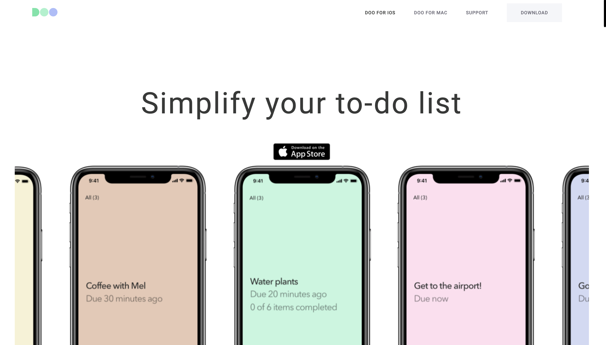

# Doo

Web page for simple todo list application.

[Preview](https://simakol.github.io/Doo/)

## Attention to Details

- Beautiful and smooth scrolling and hovering animations
- High performance on different devices
- Adaptive layout 
- Custom selection
- Custom scrollbar

## Technologies udes

- HTML
- SASS
- JS, DOM
- Gulp
- Open Graph
- Git

## Run and Build

- `npm run dev` - opens site in developer mode using a live server
- `npm run build` - builds the site into a final assembly
- `npm run zip` - gathers the site into an zip archive
- `npm run deploy` - places the site on your FTP server (but for this you need to fill in your server data in the file `src/gulp/config/ftp.js`)

